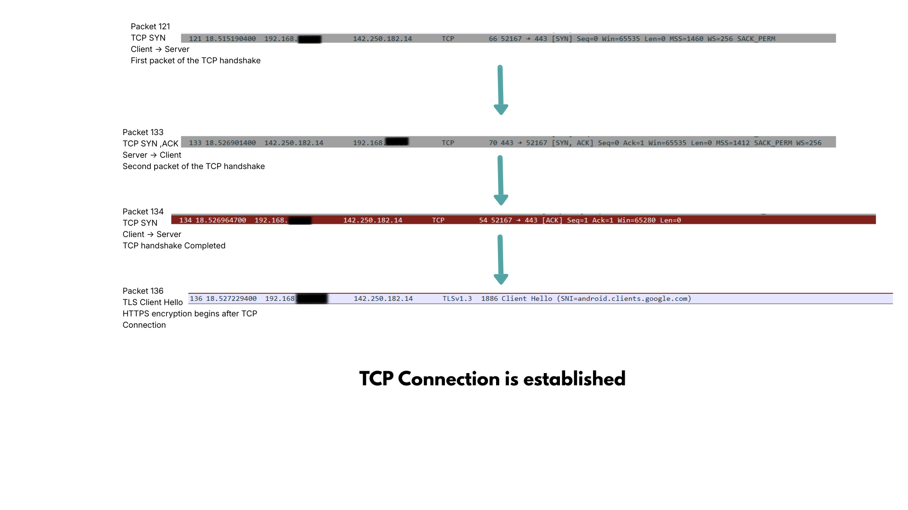

</> Markdown
---
# Objective
The objective of this investigation was to capture HTTPS network traffic and identify the TCP Three-Way Handshake used to establish a reliable connection between a client and a server.

This investigation demonstrates how TCP ensures reliable communication before any encrypted HTTPS data is transmitted.

---
## Background
Transmission Control Protocol (TCP) is a connection-oriented transport layer protocol responsible for providing reliable communication over IP networks.

Before exchanging data, TCP establishes a connection through a process known as the Three-Way Handshake.

The handshake consists of:

- SYN
- SYN-ACK
- ACK

Only after these packets are exchanged can application data be transmitted.
---
</> Markdown
## Tools Used
| Tool | Purpose |
|------|---------|
| Wireshark | Packet capture |
| Windows 11 | Operating System |
| Google Chrome | Generate HTTPS traffic |
---
## Investigation Procedure
1. Started packet capyure using wireshark.
2. Opened https://ww.google.com.
3. Allowed traffic to generate.
4. Stopped packet capture.
5. Applied the TCP filter.
6. Identified the TCP handshake.
---
</> Markdown
## TCP Three-Way Handshake 

---
## Cybersecurity Perspective

Understanding the TCP handshake helps security analysts:

- Detect SYN Flood attacks
- Identify failed TCP connections
- Investigate network latency
- Detect retransmissions
- Troubleshoot firewall issues

---
## Real-world Scenario

A user reports that a website is unreachable.

Using Wireshark, a SOC analyst observes repeated SYN packets with no SYN-ACK response.

This indicates:

- Firewall blocking
- Server unavailable
- Packet loss
- Routing issue

---
# Key Learning

This investigation demonstrates how TCP establishes reliable communication before transmitting data.

Without completing the Three-Way Handshake, no secure HTTPS communication can occur.

---

# Conclusion
The TCP Three-Way Handshake is one of the most fundamental networking processes.

Understanding each packet exchanged during connection establishment is essential for troubleshooting, cybersecurity monitoring, and digital forensics investigations.