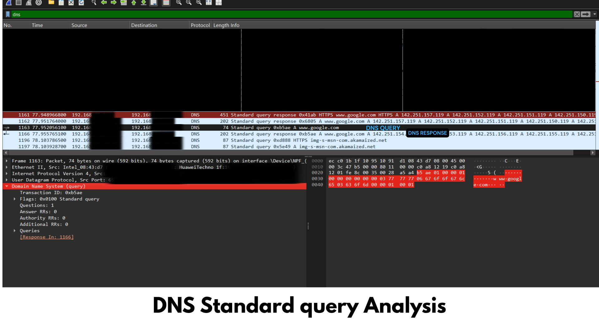

# DNS Analysis Investigation
## Objective
To analyze the Domain Name System (DNS) resolution process using Wireshark and understand how domain names are translated into IP addresses before communication begins.
---
## Tools Used
- Wireshark
- Windows 11
- Microsoft Edge
- Internet Connection
---
## Procedure
1. Opened Wireshark.
2. Started capturing packets on the active network interface.
3. Cleared the DNS cache using:
```cmd
ipconfig /flushdns
```
4. Opened `https://www.google.com`.
5. Stopped the capture.
6. Applied the filter:
```
dns
```
7. Observed DNS Query and DNS Response packets.

---

## Wireshark Filter

```
dns
```

---
## Observations

- The client sent a DNS Standard Query requesting the IP address of  www.google.com.
- The DNS server responded with one or more IPv4 addresses.
- The response contained the Answer section with the resolved IP address.
- DNS communication occurred over UDP port 53.
## Screenshot

---
## Packet Analysis

### DNS Query

- Source: Client
- Destination: DNS Server
- Protocol: DNS
- Query Type: A Record
- Requested Domain: www.google.com

### DNS Response

- Source: DNS Server
- Destination: Client
- Contains resolved IPv4 address
- Response Code: No Error (0)

---

## Cybersecurity Perspective

DNS analysis helps security analysts to:

- Detect DNS tunneling attacks
- Identify malicious domains
- Investigate malware communication
- Detect DNS spoofing or cache poisoning
- Monitor unusual DNS traffic

---
## Key Learning

This investigation demonstrated how DNS translates human-readable domain names into IP addresses before establishing network communication. Understanding DNS traffic is essential for network troubleshooting and cybersecurity investigations.