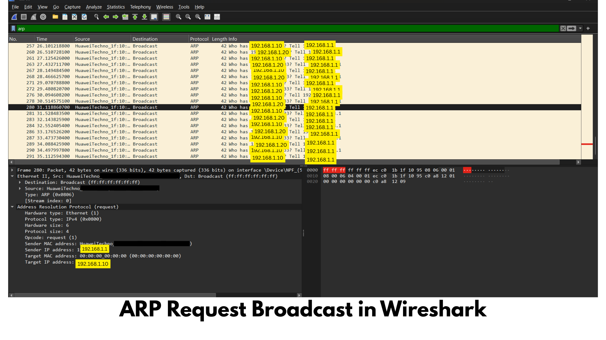

# ARP (Address Resolution Protocol) Analysis

## Objective

To analyze the Address Resolution Protocol (ARP) using Wireshark and understand how devices discover the MAC addresses of other devices within the same local network. This investigation also explores common ARP-based attacks and their detection.

---

## Tools Used

- Wireshark
- Windows 11
- Command Prompt
- Microsoft Edge

---

## Procedure

1. Opened Wireshark.
2. Started packet capture on the active network interface.
3. Generated network activity by opening websites and communicating with devices on the local network.
4. Applied the display filter:

```
arp
```

5. Observed ARP Request and ARP Reply packets.

---

## Wireshark Filter

```
arp
```

---

## Screenshot



---

## Packet Analysis

### ARP Request

Example:

```
Who has 192.168.16.1?
Tell 192.168.16.24
```

This packet is broadcast to every device on the local network.

Meaning:

"My IP address is 192.168.16.24. I want to communicate with 192.168.16.1, but I don't know its MAC address. Can the owner of this IP please tell me?"

Destination MAC Address:

```
FF:FF:FF:FF:FF:FF
```

This is the broadcast MAC address, meaning every device on the LAN receives the request.

---

### ARP Reply

Example:

```
192.168.16.1 is at XX:XX:XX:XX:XX:XX
```

The device owning the requested IP replies with its MAC address.

Only the requesting computer receives this reply.

---

## Observations

- ARP operates only within a Local Area Network (LAN).
- ARP maps IPv4 addresses to physical MAC addresses.
- ARP does not cross routers.
- ARP Requests are broadcast.
- ARP Replies are unicast.
- Devices store discovered MAC addresses in the ARP Cache for future communication.

---

## Cybersecurity Perspective

ARP is one of the most frequently abused protocols inside local networks because it has no built-in authentication.

### ARP Spoofing (ARP Poisoning)

An attacker sends forged ARP replies to victims.

Instead of:

```
Gateway
↓

192.168.16.1

↓

AA:BB:CC:DD:EE:FF
```

The victim receives:

```
192.168.16.1

↓

Attacker's MAC Address
```

The victim unknowingly sends all traffic to the attacker.

Possible consequences:

- Man-in-the-Middle (MITM) Attack
- Password theft
- Session hijacking
- Traffic monitoring
- Data manipulation
- Denial of Service

---

## Detection

Using Wireshark, suspicious ARP activity may include:

- Multiple ARP replies without corresponding requests
- One MAC address claiming multiple IP addresses
- Frequent ARP broadcasts
- Duplicate IP address announcements
- Rapid ARP table changes

---

## Prevention

- Dynamic ARP Inspection (DAI)
- Static ARP Entries (critical systems)
- Switch Port Security
- VLAN Segmentation
- Network Access Control (NAC)
- Intrusion Detection Systems (IDS)
- Monitor ARP tables regularly
- Use HTTPS and VPNs to reduce the impact of MITM attacks

---

## Key Learning

This investigation demonstrated how ARP enables communication within a local network by resolving IP addresses into MAC addresses. Understanding normal ARP behavior makes it easier to detect attacks such as ARP spoofing and Man-in-the-Middle attacks.

---

## Conclusion

ARP is an essential protocol used for local network communication. However, because it lacks authentication, attackers can exploit it using ARP spoofing or poisoning. Monitoring ARP traffic with Wireshark helps cybersecurity analysts identify suspicious behavior, investigate network issues, and detect potential Man-in-the-Middle attacks.