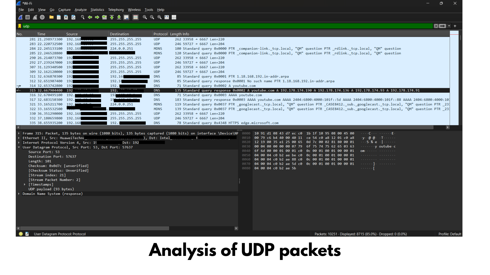

# UDP (User Datagram Protocol) Analysis

## Objective

To analyze User Datagram Protocol (UDP) packets using Wireshark and understand how UDP provides fast, connectionless communication. This investigation also explores common applications of UDP, its advantages, limitations, and potential security threats.

---

## Tools Used

- Wireshark
- Windows 11
- Microsoft Edge
- Windows Command Prompt

---

## Procedure

1. Opened Wireshark.
2. Started capturing packets on the active network interface.
3. Generated network traffic by browsing websites and using applications that communicate over UDP.
4. Applied the display filter:

```
udp
```

5. Observed UDP packets and analyzed their headers.

---

## Wireshark Filter

```
udp
```

---

## Screenshot



---

## Packet Analysis

The selected UDP packet contains the following information:

### Source IP

The IP address of the sender.

### Destination IP

The IP address of the receiver.

### Source Port

A temporary (ephemeral) port chosen by the operating system for communication.

### Destination Port

The port number associated with the destination service.

Examples include:

- DNS – Port 53
- DHCP – Ports 67 and 68
- NTP – Port 123
- QUIC (HTTP/3) – Port 443

### Length

Represents the size of the UDP header and data.

### Checksum

A value used to detect errors during transmission.

If the checksum validation fails, the packet may be discarded because its contents could have been corrupted.

---

## Observations

- UDP is a "connectionless protocol".
- No three-way handshake is required before sending data.
- UDP does not guarantee delivery.
- Packets may arrive out of order.
- Packets may be lost without retransmission.
- UDP has lower overhead than TCP, making it faster for real-time applications.

---

## Applications of UDP

UDP is commonly used by:

- DNS
- DHCP
- VoIP
- Video conferencing
- Online gaming
- Live streaming
- QUIC (HTTP/3)
- Network Time Protocol (NTP)

These applications prioritize speed and low latency over guaranteed delivery.

---

## Cybersecurity Perspective

UDP traffic can be abused in several types of attacks.

### UDP Flood Attack

An attacker sends a very large number of UDP packets to overwhelm a target system.

Result:

- High CPU utilization
- Network congestion
- Denial of Service (DoS)

---

### UDP Amplification Attack

The attacker sends small spoofed UDP requests to public servers.

Those servers respond with much larger replies to the victim.

Common protocols abused include:

- DNS
- NTP
- SSDP
- Memcached

This dramatically increases the amount of traffic reaching the victim.

---

### Reflection Attack

The attacker spoofs the victim's IP address.

Multiple UDP servers send responses to the victim instead of the attacker.

The victim becomes overwhelmed with unsolicited traffic.

---

## Detection

A cybersecurity analyst should look for:

- Excessive UDP packets
- Unusually high traffic to one destination
- Unexpected UDP services
- High-bandwidth DNS or NTP traffic
- Large numbers of packets from multiple sources
- Sudden spikes in UDP activity

---

## Prevention

- Configure firewalls to restrict unnecessary UDP ports.
- Disable unused UDP services.
- Apply rate limiting.
- Deploy IDS/IPS solutions.
- Use anti-DDoS protection.
- Keep network devices updated.
- Block unnecessary amplification services.

---

## Key Learning

This investigation demonstrated how UDP enables fast communication without establishing a connection. Although UDP provides excellent performance for real-time applications, its lack of reliability and authentication makes it susceptible to abuse in amplification and flooding attacks.

---

## Conclusion

UDP is a lightweight transport protocol designed for speed and efficiency. It is widely used by latency-sensitive applications such as DNS, online gaming, video conferencing, and streaming. Understanding UDP traffic enables cybersecurity analysts to troubleshoot network issues and detect attacks such as UDP floods and amplification attacks.