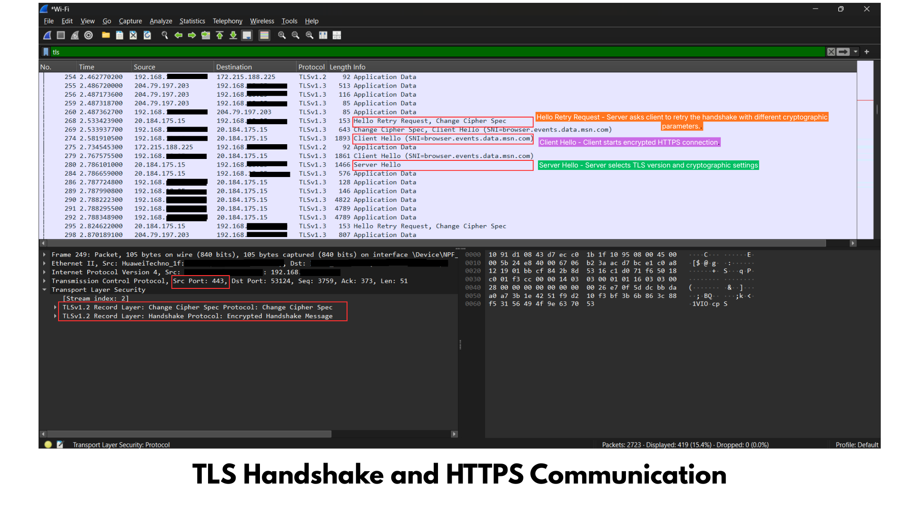

# Objective

To analyze the TLS (Transport Layer Security) handshake in Wireshark and understand how HTTPS establishes a secure encrypted connection between a client and a web server.

---

# Tools Used

- Wireshark
- Microsoft Edge
- Windows 11

---

# Procedure

1. Opened Wireshark.
2. Started capturing packets on the active Wi-Fi interface.
3. Opened https://www.google.com in the browser.
4. Allowed network traffic to generate.
5. Stopped the packet capture.
6. Applied the filter:

```text
tls
```

If no packets appeared, used:

```text
tcp.port == 443
```

7. Identified the TLS handshake packets.

---

# Observations

- HTTPS traffic was exchanged over TCP port "443".
- The communication started with a "Client Hello" packet.
- The server replied with a "Server Hello" packet.
- The server transmitted its "digital certificate".
- A secure encrypted session was established.
- All remaining communication appeared as "Application Data", indicating encrypted traffic.

---

# Key Packet Analysis

### Client Hello
The client initiates the secure connection by sending:
- Supported TLS versions
- Supported cipher suites
- Random value
- TLS extensions
- Server Name Indication (SNI)

### Server Hello
The server responds by selecting:
- TLS version
- Cipher suite
- Session parameters

### Certificate
The server sends its digital certificate, allowing the client to verify:
- Server identity
- Trusted Certificate Authority (CA)
- Certificate validity

### Application Data
After the TLS handshake completes, all transmitted data is encrypted and displayed as "Application Data" in Wireshark.

---

# Screenshot

## TLS Handshake in Wireshark



---

# Cybersecurity Perspective

Understanding TLS traffic helps security analysts:

- Verify secure HTTPS communication
- Detect expired or invalid certificates
- Investigate encrypted network sessions
- Identify TLS downgrade attacks
- Troubleshoot HTTPS connectivity problems
- Ensure sensitive information is transmitted securely

---

# Conclusion

This investigation demonstrated how HTTPS uses TLS to establish a secure encrypted connection. The TLS handshake authenticates the server, negotiates encryption parameters, and protects data confidentiality and integrity throughout the communication.

