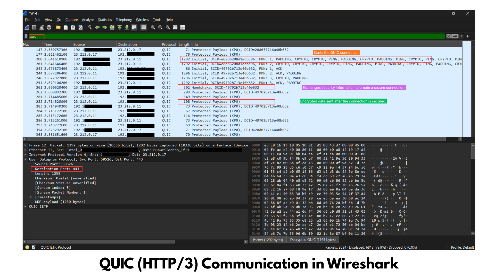

# QUIC and HTTP/3 Analysis

## Objective

To analyze QUIC and HTTP/3 traffic using Wireshark and understand how modern web browsers establish secure, low-latency connections over UDP instead of TCP.

---

## Tools Used

- Wireshark
- Microsoft Edge
- Windows 11

---

## Procedure

1. Open Wireshark.
2. Select the active Wi-Fi interface.
3. Start packet capture.
4. Visit websites such as:
   - https://www.google.com
   - https://www.youtube.com
5. Stop the capture after the page loads.
6. Apply the filter:

```text
quic
```

If no packets appear, try:

```text
udp.port == 443
```

or

```text
http3
```

7. Observe the QUIC packets and HTTP/3 communication.

---

## Observation

The packet capture displayed UDP packets using the QUIC protocol over port 443.

Unlike HTTPS over TLS, QUIC combines transport reliability, encryption, and connection establishment into a single protocol.

The capture contained encrypted application data exchanged between the client and server while reducing connection setup time.

---

## Screenshot

### QUIC / HTTP3 Traffic in Wireshark



---

## Packet Analysis

### Source IP
Client device

### Destination IP
Remote web server

### Transport Protocol
UDP

### Default Port
443

### Application Protocol
HTTP/3

### Encryption
TLS 1.3 integrated into QUIC

### Packet Types Observed

- Initial Packet
- Handshake Packet
- Short Header Packet
- Protected Application Data

---

## Key Findings

- QUIC operates over UDP instead of TCP.
- Encryption begins immediately during connection establishment.
- TCP Three-Way Handshake is not required.
- TLS 1.3 is built directly into QUIC.
- Connection establishment is significantly faster than HTTPS over TCP.
- Packet payload remains encrypted.
- QUIC reduces latency for modern web applications.

---

## Difference Between TLS and QUIC

| TLS over TCP | QUIC |
|--------------|------|
| Uses TCP | Uses UDP |
| Requires TCP Three-Way Handshake | No TCP handshake |
| TLS handshake happens after TCP connection | TLS is integrated |
| Higher connection latency | Lower latency |
| Retransmits entire TCP stream | Retransmits only lost data |
| Susceptible to Head-of-Line Blocking | Avoids Head-of-Line Blocking |

---

## Cybersecurity Perspective

Understanding QUIC traffic helps security analysts:

- Monitor HTTP/3 communication
- Detect malicious encrypted traffic
- Identify unauthorized QUIC applications
- Investigate UDP-based attacks
- Monitor encrypted malware communication
- Detect data exfiltration over QUIC
- Verify secure browser communication

---

## SOC Investigation

During incident response, analysts inspect QUIC traffic to:

- Verify legitimate HTTP/3 connections
- Detect suspicious UDP port 443 traffic
- Identify encrypted command-and-control communication
- Investigate abnormal connection frequency
- Detect data exfiltration attempts
- Correlate QUIC traffic with DNS requests

---

## Security Concerns

Although QUIC improves performance, encrypted traffic can also be abused by attackers.

Possible threats include:

- Malware communication
- Data exfiltration
- Command-and-Control channels
- Encrypted phishing infrastructure
- Hidden malicious traffic

---

## Prevention

- Monitor UDP port 443
- Use IDS/IPS capable of inspecting QUIC metadata
- Restrict unnecessary QUIC traffic
- Block unknown HTTP/3 destinations
- Maintain firewall rules
- Enable endpoint monitoring
- Analyze DNS and QUIC together during investigations

---

## Conclusion

The packet capture demonstrated HTTP/3 communication using the QUIC protocol over UDP. QUIC integrates TLS 1.3 encryption directly into the transport layer, reducing latency and improving performance while maintaining strong security. From a cybersecurity perspective, analysts monitor QUIC traffic to detect suspicious encrypted communication, investigate attacks, and validate secure web connections.