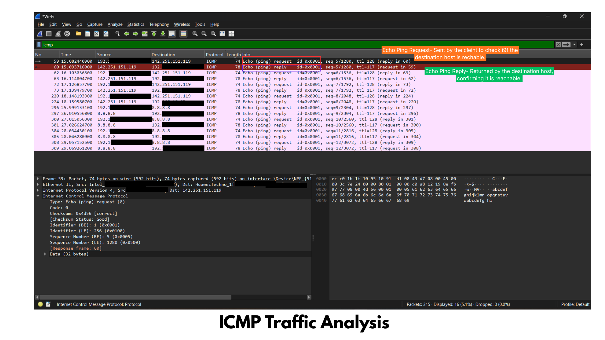

# ICMP (Ping) Analysis

## Objective

To analyze Internet Control Message Protocol (ICMP) packets using Wireshark and understand how ICMP is used for network connectivity testing, troubleshooting, and error reporting.

---

# Tools Used

- Wireshark
- Windows 11
- Command Prompt

---

# Procedure

1. Open Wireshark.
2. Start packet capture on the active network interface.
3. Open Command Prompt.
4. Run the following command:

```text
ping google.com
```

or

```text
ping 8.8.8.8
```

5. Stop the packet capture.
6. Apply the filter:

```text
icmp
```

7. Observe the ICMP Echo Request and Echo Reply packets.

---

# Wireshark Filter

```text
icmp
```

---

# Screenshot

## ICMP Echo Request and Reply



---

# Packet Analysis

### Echo Request

The Echo Request packet is sent by the client to check whether the destination host is reachable.

Purpose:

- Test network connectivity
- Measure response time
- Verify whether a device is online

---

### Echo Reply

The Echo Reply is returned by the destination host.

It confirms that:

- The device is reachable.
- The network path is working.
- Communication is successful.

---

# Observations

- ICMP operates at the Network Layer (Layer 3).
- It does not use TCP or UDP ports.
- It is mainly used for diagnostics and error reporting.
- Each Echo Request should normally receive an Echo Reply.
- Packet size and response time can be measured.

---

# Cybersecurity Perspective

ICMP traffic is useful for:

- Network troubleshooting
- Connectivity testing
- Host discovery
- Network monitoring
- Measuring latency

Attackers may misuse ICMP for:

- Ping Sweep
- Network Reconnaissance
- ICMP Flood (DoS)
- Data Exfiltration through ICMP tunneling

---

# Detection

Suspicious ICMP activity may include:

- Thousands of Echo Requests in a short time
- Continuous Ping Sweeps
- Large ICMP packets
- Unusual ICMP payloads
- ICMP traffic to multiple hosts

---

# Prevention

- Disable ICMP where unnecessary
- Configure firewall rules
- Apply rate limiting
- Use IDS/IPS monitoring
- Monitor unusual ICMP traffic

---

# SOC Investigation

SOC analysts examine ICMP traffic to:

- Verify network connectivity
- Detect Ping Sweep attacks
- Identify reconnaissance activity
- Investigate denial-of-service attacks
- Troubleshoot network failures

---

# Conclusion

This investigation demonstrated how ICMP is used for network diagnostics. Echo Requests and Echo Replies confirm connectivity between devices and help analysts troubleshoot network issues while also identifying suspicious reconnaissance or denial-of-service activity.