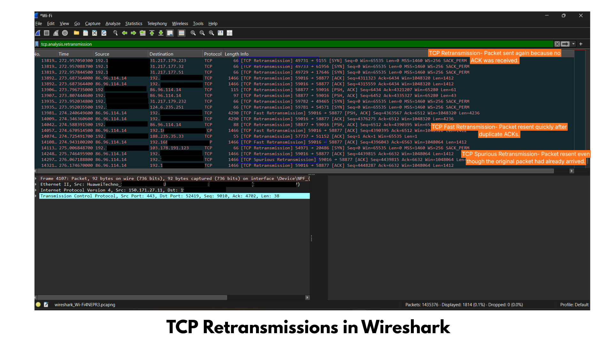

# TCP Packet Retransmission Analysis

## Objective

To identify and analyze TCP retransmission packets in Wireshark and understand their significance in network reliability and cybersecurity.

---

## Filter Used

```text
tcp.analysis.retransmission
```

---

## Observation

- Retransmission packets were identified in the network capture.
- TCP retransmits packets when acknowledgments are not received within the expected time.
- This ensures reliable data delivery between the sender and receiver.
- Frequent retransmissions may indicate packet loss, network congestion, or high latency.

---

## Explanation

TCP retransmission is a mechanism used by TCP to resend packets that were not acknowledged by the receiver. It helps maintain reliable communication by ensuring that lost packets are delivered successfully.

---

## Screenshot

### TCP Retransmission in Wireshark



---

## Cybersecurity Perspective

Understanding TCP retransmissions helps security analysts:

- Detect packet loss
- Identify network congestion
- Troubleshoot slow network performance
- Detect abnormal TCP behavior
- Verify reliable communication

---

## Conclusion

The Wireshark capture successfully identified TCP retransmission packets. Retransmissions are a normal TCP reliability feature but excessive retransmissions may indicate network issues such as congestion, latency, or packet loss. Monitoring retransmissions helps security analysts troubleshoot communication problems and maintain network performance.